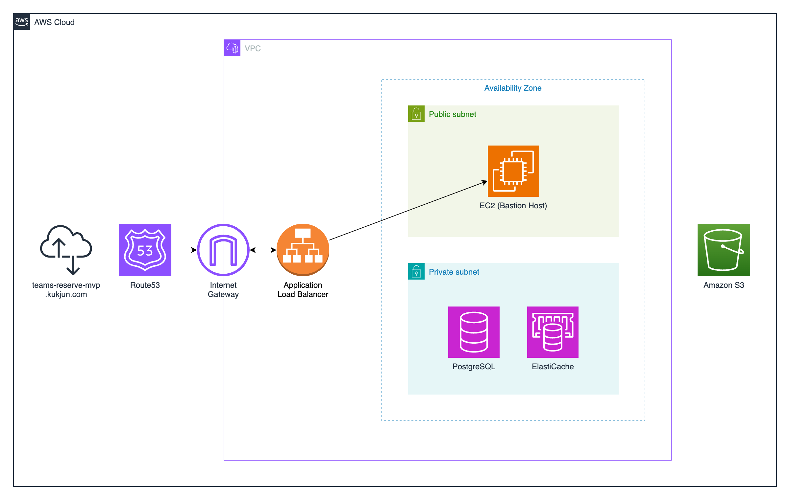

# Teams Reserve MVP Backend

> 팀별로 공간을 만들고, 그 공간을 예약할 수 있도록 만든 공간 예약 프로그램입니다. 

 
 
 

## Introduction
소규모 팀에서 팀 내 회의실을 사용할 때, 사용하려는 시간에 겹쳤던 경험이 많았습니다.

그때, 회의실 예약 시스템을 만들거나, 회의실 예약을 도와주는 유료 구독 서비스를 이용하는 것 보다 팀별로 회의실을 만들고, 이를 예약하는 시스템을 만들면 어떨까 하는 생각이 들어서, 만들어보게 되었습니다.

 

> 특정 기능에 집중 하고자, 단일 팀을 가정하고 공간, 예약 서비스를 제작했습니다.

 
 
 

## App EndPoint

---
[TeamsReserve](https://teams-reserve-mvp.kukjun.com/)

 

[TeamsReserve-Swagger](https://teams-reserve-mvp.kukjun.com/apiDocs/)

 

[API Docs](https://www.notion.so/kukjun/API-Docs-48cc57899fa749a7abeb4a84ef649bdc?pvs=4)
 
 
 
 

## Service Structure

---
**이해하기 편하도록, 권한 별로 할 수 있는 작업을 간단하게 그려두었습니다.**

 
 
 

## Architecture

---

 
 
 

## CICD Flow

### CI Flow

---

 
 
 

### CD Flow

---

 
 
 

### Test Coverage

### 그 외 작업물

---

[요구사항 명세서](https://kukjun.notion.site/bfcc20230cca49b1b6262557cc31a940?pvs=4)

[UI 스케치](https://kukjun.notion.site/UI-40af6293880641b2a3735cdd1b5bf30c?pvs=4)

[구현 기술 및 프로젝트 목표](https://kukjun.notion.site/fd67537e6499450fb1d0eea4f5d8662a?pvs=4)

[DB 설계](https://kukjun.notion.site/DB-bcc159387e5d4cdbad901e89082fd3d8?pvs=4)
